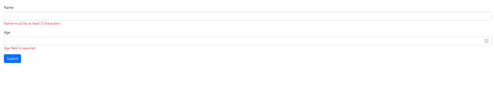
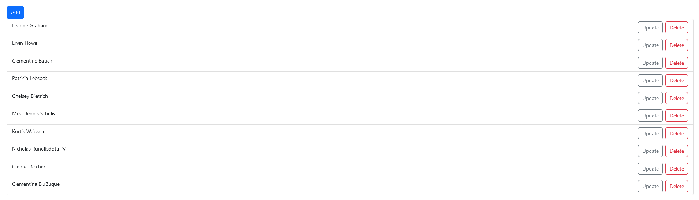

## Using `immer` library to update state logic

```tsx
import { useState } from "react";
import produce from "immer";
import Button from "./components/Button";

function App() {
  const [bugs, setBugs] = useState([
    { id: 1, title: "Bug 1", fixed: false },
    { id: 2, title: "Bug 2", fixed: false },
  ]);

  const handleClick = () => {
    // setBugs(bugs.map(bug => bug.id === 1 ? {...bug, fixed: true} : bug));
    setBugs(
      produce((draft) => {
        const bug = draft.find((bug) => bug.id === 1);
        if (bug) bug.fixed = true;
      })
    );
  };

  return (
    <div>
      {bugs.map((bug) => (
        <p key={bug.id}>
          {bug.title} {bug.fixed ? "Fixed" : "New"}
        </p>
      ))}
      <Button onClick={handleClick}>Click Me</Button>
    </div>
  );
}

export default App;
```

```tsx
import { useState } from "react";
// import { produce } from 'immer';

function App() {
  const [cart, setCart] = useState({
    discount: 0.1,
    items: [
      { id: 1, title: "Product 1", quantity: 1 },
      { id: 2, title: "Product 2", quantity: 1 },
    ],
  });

  const handleClick = () => {
    setCart({
      ...cart,
      items: cart.items.map((item) =>
        item.id === 1 ? { ...item, quantity: item.quantity + 1 } : item
      ),
    });
  };

  return (
    <div>
      <ul>
        {cart.items.map((item) => (
          <li>
            {item.title} - Quantity: {item.quantity}
          </li>
        ))}
      </ul>
      <button onClick={handleClick}>Click Me</button>
    </div>
  );
}

export default App;

// without using immer

// Method 1
// const handleClick = () => {
//   setCart((prevCart) => ({
//     ...prevCart,
//     items: prevCart.items.map((item) =>
//       item.id === 1 ? { ...item, quantity: 2 } : item
//     ),
//   }));
// };

// Method 2

// using immer
// const handleClick = () => {
//   setCart(
//     produce(draft => {
//       const item = draft.items.find(item => item.id === 1);
//       if(item) item.quantity=2;
//     } )
//   );
// };
```

### Creating an expandable component

This is the `expandable.tsx` code

```tsx
interface Props {
  children: string;
  textLength: 100 | 20 | "auto";
  expandText: () => void;
  minimizeText: () => void;
  btnText: string;
}

const ExpandableText = ({
  children,
  textLength,
  expandText,
  minimizeText,
  btnText,
}: Props) => {
  const displayedText =
    textLength === "auto" ? children : children.substring(0, textLength);
  return (
    <div>
      <p>{displayedText}</p>
      {textLength === "auto" ? (
        <button onClick={minimizeText}>Less</button>
      ) : (
        <button onClick={expandText}>{btnText}</button>
      )}
    </div>
  );
};

export default ExpandableText;
```

This is the `app.tsx` code

```tsx
import { useState } from "react";
import ExpandableText from "./components/ExpandableText";

function App() {
  // state of text
  const [textLength, setTextLength] = useState<100 | 20 | "auto">(100);

  // state of button
  const [btnText, setBtnText] = useState("More");

  // function to expand the text
  const expandText = () => {
    if (textLength === 100) {
      setTextLength("auto");
      setBtnText("Less");
    } else if (textLength === 20) {
      setTextLength("auto");
      setBtnText("Less");
    }
  };

  // function to minimize the text
  const minimizeText = () => {
    setTextLength(20);
    setBtnText("More");
  };

  return (
    <div>
      <ExpandableText
        textLength={textLength}
        expandText={expandText}
        minimizeText={minimizeText}
        btnText={btnText}
      >
        Lorem ipsum, dolor sit amet consectetur adipisicing elit. Nobis enim
        culpa amet. Est adipisci voluptatum quas nostrum aliquid architecto
        minus, cupiditate quibusdam placeat vitae libero et dicta asperiores.
        Dolorem nulla eligendi distinctio repudiandae ipsam rem iste
        perspiciatis fuga fugiat illum incidunt, asperiores placeat ullam sunt
        voluptates doloremque ut? Ipsa odit eos assumenda sunt enim,
        consequuntur repudiandae architecto ipsam eligendi nobis quas eaque
        iure, reiciendis dolorum voluptate deserunt, ut doloremque quis hic
        necessitatibus pariatur perspiciatis odio dolores! Quasi aspernatur
        dignissimos laborum tenetur. Quos ea assumenda voluptates eligendi!
        Accusantium hic pariatur esse quis quaerat, incidunt rerum ut tempore
        ipsum obcaecati ipsam facilis id vel perferendis optio odit a deserunt
        dolores similique. Inventore obcaecati tenetur magni porro praesentium
        ab eos laudantium iure soluta vel, blanditiis aliquid nam autem quas,
        fuga fugiat velit perferendis sint ipsum laborum quod qui maxime non
        accusamus. Asperiores possimus dolor aliquid? Voluptatum doloremque
        dolore, hic quis, voluptatem culpa magni delectus quos voluptatibus ipsa
        laborum non harum deleniti ut iusto nulla sed neque quod voluptas ullam
        nam autem illum minima cumque. Totam corporis fugit nulla voluptatem
        harum blanditiis obcaecati esse veritatis quis, libero magni officiis
        consectetur, repellat possimus? Id quia similique modi mollitia deleniti
        a odit magni exercitationem assumenda excepturi.
      </ExpandableText>
    </div>
  );
}

export default App;
```

#### Method provided

```tsx
import { useState } from "react";

interface Props {
  children: string;
  maxChars: number;
}

const ExpandableText = ({ children, maxChars = 100 }: Props) => {
  const [isExpanded, setIsExpanded] = useState(false);

  const handleClick = () => {
    setIsExpanded(!isExpanded);
  };

  if (children.length <= maxChars) return <p>{children}</p>;

  const txt = isExpanded ? children : children.substring(0, maxChars);
  return (
    <p>
      {txt}...
      <button onClick={handleClick}>{isExpanded ? "Less" : "More"}</button>
    </p>
  );
};

export default ExpandableText;
```

```tsx
//import { useState } from "react";
import ExpandableText from "./components/ExpandableText";

function App() {
  return (
    <div>
      <ExpandableText maxChars={30}>
        Lorem ipsum dolor sit amet consectetur adipisicing elit. Et, obcaecati
        nihil dolorum odio, ipsum accusantium voluptas officia ipsam nulla
        similique magni ducimus architecto? Ad ipsam recusandae inventore
        deserunt maiores qui?
      </ExpandableText>
    </div>
  );
}

export default App;
```

### Forms

Getting values of input field using useRef() hook

```tsx
import { FormEvent, useRef } from "react";

const Form = () => {
  const nameRef = useRef<HTMLInputElement>(null);
  const ageRef = useRef<HTMLInputElement>(null);
  const person = { name: "", age: 0 };

  const handleSubmit = (event: FormEvent) => {
    event.preventDefault();
    if (nameRef.current !== null) person.name = nameRef.current.value;
    if (ageRef.current !== null) person.age = parseInt(ageRef.current.value);
    console.log(person);
  };
  return (
    <form onSubmit={handleSubmit}>
      <div className="mb-3">
        <label htmlFor="name" className="form-label">
          Name
        </label>
        <input id="name" ref={nameRef} type="text" className="form-control" />
      </div>
      <div className="mb-3">
        <label htmlFor="age" className="form-label">
          Age
        </label>
        <input id="age" ref={ageRef} type="number" className="form-control" />
      </div>
      <button className="btn btn-primary" type="submit">
        Submit
      </button>
    </form>
  );
};

export default Form;
```

Using state hook to get input values

```tsx
import { FormEvent, useState } from "react";

const Form = () => {
  const [person, setPerson] = useState({
    name: "",
    age: "",
  });
  const handleSubmit = (event: FormEvent) => {
    event.preventDefault();
    console.log(person);
  };
  return (
    <form onSubmit={handleSubmit}>
      <div className="mb-3">
        <label htmlFor="name" className="form-label">
          Name
        </label>
        <input
          id="name"
          // makes input value be controlled entirely by the state and not managed by the DOM
          value={person.name}
          onChange={(event) =>
            setPerson({ ...person, name: event.target.value })
          }
          type="text"
          className="form-control"
        />
      </div>
      <div className="mb-3">
        <label htmlFor="age" className="form-label">
          Age
        </label>
        <input
          id="age"
          value={person.age}
          onChange={(event) =>
            setPerson({ ...person, age: parseInt(event.target.value) })
          }
          type="number"
          className="form-control"
        />
      </div>
      <button className="btn btn-primary" type="submit">
        Submit
      </button>
    </form>
  );
};

export default Form;
```

Using the react hook form library

```tsx
import { FieldValues, useForm } from "react-hook-form";

const Form = () => {
  const { register, handleSubmit } = useForm();
  const onSubmit = (data: FieldValues) => console.log(data);
  return (
    <form onSubmit={handleSubmit(onSubmit)}>
      <div className="mb-3">
        <label htmlFor="name" className="form-label">
          Name
        </label>
        <input
          {...register("name")}
          id="name"
          type="text"
          className="form-control"
        />
      </div>
      <div className="mb-3">
        <label htmlFor="age" className="form-label">
          Age
        </label>
        <input
          {...register("age")}
          id="age"
          type="number"
          className="form-control"
        />
      </div>
      <button className="btn btn-primary" type="submit">
        Submit
      </button>
    </form>
  );
};

export default Form;
```

Handling validation using zod lib

```tsx
import { FieldValues, useForm } from "react-hook-form";
import { z } from "zod";
import { zodResolver } from "@hookform/resolvers/zod/dist/zod.js";

// using z object method to configure validation rules
const schema = z.object({
  name: z.string().min(3, { message: "Name must be at least 3 characters" }),
  age: z
    .number({ invalid_type_error: "Age field is required" })
    .min(18, { message: "Age must be at least 18" }),
});

// returning typecript type(similar to an interface)
type FormData = z.infer<typeof schema>;

const Form = () => {
  // nested destructuring of the formState property to get the errors using formState: {errors}
  const {
    register,
    handleSubmit,
    formState: { errors },
  } = useForm<FormData>({ resolver: zodResolver(schema) });

  const onSubmit = (data: FieldValues) => console.log(data);
  return (
    <form onSubmit={handleSubmit(onSubmit)}>
      <div className="mb-3">
        <label htmlFor="name" className="form-label">
          Name
        </label>
        <input
          {...register("name")}
          id="name"
          type="text"
          className="form-control"
        />
        {errors.name && <p className="text-danger">{errors.name.message}</p>}
      </div>
      <div className="mb-3">
        <label htmlFor="age" className="form-label">
          Age
        </label>
        <input
          {...register("age", { valueAsNumber: true })}
          id="age"
          type="number"
          className="form-control"
        />
        {errors.age && <p className="text-danger">{errors.age.message}</p>}
      </div>
      <button className="btn btn-primary" type="submit">
        Submit
      </button>
    </form>
  );
};

export default Form;
```

Output:



### Error map function

```tsx
const schema = z.object({
  description: z
    .string()
    .min(3, { message: "Description should be at least 3 characters" })
    .max(50, { message: "Description has a 50 character maximum limit" }),
  amount: z
    .number({ invalid_type_error: "Amount is required" })
    .min(0.01)
    .max(100_000),
  category: z.enum(categories, {
    errorMap: () => ({ message: "Category is required" }),
  }),
});
```

`errorMap` Option:

    The errorMap option allows you to customize the error message if the validation fails.
    In this case, if the value of category is not one of the specified strings in categories, the error message will be 'Category is required'.

### useEffect() hook

Resource

- https://react.dev/learn/synchronizing-with-effects#how-to-handle-the-effect-firing-twice-in-development
  useEffect is a React Hook that lets you synchronize a component with an external system.
  Every time your component renders, React will update the screen and then run the code inside useEffect. In other words, useEffect “delays” a piece of code from running until that render is reflected on the screen.
  syntax

```tsx
useEffect(setup, dependencies?)
```

```tsx
import { useEffect, useRef } from "react";

function App() {
  const ref = useRef<HTMLInputElement>(null);

  useEffect(() => {
    // side effect
    if (ref.current) ref.current.focus();
  });

  useEffect(() => {
    document.title = "My APP";
  });

  return (
    <div>
      <input ref={ref} type="text" className="form-control" />
    </div>
  );
}

export default App;
```

```tsx
useEffect(() => {
  // This runs after every render
});

useEffect(() => {
  // This runs only on mount (when the component appears)
}, []);

useEffect(() => {
  // This runs on mount *and also* if either a or b have changed since the last render
}, [a, b]);
```

```tsx
// code to simulate connecting and disconnecting to a chat server
/*
Some Effects need to specify how to stop, undo, or clean up whatever they were doing. 
For example, “connect” needs “disconnect”, “subscribe” needs “unsubscribe”, and “fetch” needs either “cancel” or “ignore”. 
You will learn how to do this by returning a cleanup function.
*/

import { useEffect } from "react";

const connect = () => console.log("✅Connected");
const disconnect = () => console.log("❌Disconnected");

function App() {
  useEffect(() => {
    connect();
    // clean up code
    return () => disconnect();
  }, []);
  return <div></div>;
}

export default App;
```

### Fetching data with axios

```tsx
/*
Using Axios to fetch fake user data from JSONplaceholder
Axios is a Javascript library used to make HTTP requests from node. js or XMLHttpRequests from the browser
*/

import axios from "axios";
import { useEffect, useState } from "react";

interface User {
  id: number;
  name: string;
}

function App() {
  const [users, setUsers] = useState<User[]>([]);

  useEffect(() => {
    axios
      .get<User[]>("https://jsonplaceholder.typicode.com/users")
      .then((response) => setUsers(response.data));
  }, []);

  return (
    <ul>
      {users.map((user) => (
        <li key={user.id}>{user.name}</li>
      ))}
    </ul>
  );
}

export default App;
```

Handling errors using then and catch method

```tsx
/*
Using Axios to fetch fake user data from JSONplaceholder
Axios is a Javascript library used to make HTTP requests from node. js or XMLHttpRequests from the browser
*/

import axios from "axios";
import { useEffect, useState } from "react";

interface User {
  id: number;
  name: string;
}

function App() {
  const [users, setUsers] = useState<User[]>([]);
  const [error, setError] = useState("");

  useEffect(() => {
    axios
      .get<User[]>("https://jsonplaceholder.typicode.com/uusers")
      .then((response) => setUsers(response.data))
      // catch errors
      .catch((err) => setError(err.message));
  }, []);

  return (
    <>
      {error && <p className="text-danger">{error}</p>}
      <ul>
        {users.map((user) => (
          <li key={user.id}>{user.name}</li>
        ))}
      </ul>
    </>
  );
}

export default App;
```

Handling errors using await and async, try and catch block

```tsx
/*
Using Axios to fetch fake user data from JSONplaceholder
Axios is a Javascript library used to make HTTP requests from node. js or XMLHttpRequests from the browser
*/

import axios, { AxiosError } from "axios";
import { useEffect, useState } from "react";

interface User {
  id: number;
  name: string;
}

function App() {
  const [users, setUsers] = useState<User[]>([]);
  const [error, setError] = useState("");

  useEffect(() => {
    const fetchUsers = async () => {
      try {
        const response = await axios.get<User[]>(
          "https://jsonplaceholder.typicode.com/uusers"
        );

        setUsers(response.data);
      } catch (err) {
        setError((err as AxiosError).message);
      }
    };

    fetchUsers();

    // .then((response) => setUsers(response.data))
    // // catch errors
    // .catch((err) => setError(err.message));
  }, []);

  return (
    <>
      {error && <p className="text-danger">{error}</p>}
      <ul>
        {users.map((user) => (
          <li key={user.id}>{user.name}</li>
        ))}
      </ul>
    </>
  );
}

export default App;
```

### Cancelling Fetch Requests

```tsx
/*
Cancelling the fetch request
Using AbortController to create a clean up function code so that the user data is not fetched
AbortController is a built in class in browsers that allows one to abort asynchronous operations e.g Fetch requests
*/

import axios, { CanceledError } from "axios";
import { useEffect, useState } from "react";

interface User {
  id: number;
  name: string;
}

function App() {
  const [users, setUsers] = useState<User[]>([]);
  const [error, setError] = useState("");

  useEffect(() => {
    // controller object
    const controller = new AbortController();
    axios
      .get("https://jsonplaceholder.typicode.com/users", {
        signal: controller.signal,
      })
      .then((response) => setUsers(response.data))
      .catch((error) => {
        if (error instanceof CanceledError) return;
        setError(error.message);
      });

    // clean up function
    return () => controller.abort();
  }, []);

  return (
    <>
      {error && <p className="text-danger">{error}</p>}
      <ul>
        {users.map((user) => (
          <li key={user.id}>{user.name}</li>
        ))}
      </ul>
    </>
  );
}

export default App;
```

### Deleting Data

```tsx
/*
Showing a Loading indicator when fetchng the data
*/

import axios, { CanceledError } from "axios";
import { useEffect, useState } from "react";

interface User {
  id: number;
  name: string;
}

function App() {
  const [users, setUsers] = useState<User[]>([]);
  const [error, setError] = useState("");
  const [loading, setLoading] = useState(false);

  useEffect(() => {
    // controller object
    const controller = new AbortController();

    setLoading(true);
    axios
      .get("https://jsonplaceholder.typicode.com/users", {
        signal: controller.signal,
      })
      .then((response) => {
        setUsers(response.data);
        setLoading(false);
      })
      .catch((error) => {
        if (error instanceof CanceledError) return;
        setError(error.message);
        setLoading(false);
      });

    return () => controller.abort();
  }, []);

  const deleteUser = (user: User) => {
    const originalUsers = [...users];
    //optimistic update( update UI first then call server)
    setUsers(users.filter((u) => u.id !== user.id));
    axios
      .delete("https://jsonplaceholder.typicode.com/users/" + user.id)
      .catch((err) => {
        setError(err.message);
        setUsers(originalUsers);
      });
  };

  return (
    <>
      {error && <p className="text-danger">{error}</p>}
      {loading && <div className="spinner-border"></div>}
      <ul className="list-group">
        {users.map((user) => (
          <li
            key={user.id}
            className="list-group-item d-flex justify-content-between"
          >
            {user.name}
            <button
              className="btn btn-outline-danger"
              onClick={() => deleteUser(user)}
            >
              Delete
            </button>
          </li>
        ))}
      </ul>
    </>
  );
}

export default App;
```

### Creating Data

```tsx
/*
Adding new users using the POST method
*/

import axios, { CanceledError } from "axios";
import { useEffect, useState } from "react";

interface User {
  id: number;
  name: string;
}

function App() {
  const [users, setUsers] = useState<User[]>([]);
  const [error, setError] = useState("");
  const [loading, setLoading] = useState(false);

  useEffect(() => {
    // controller object
    const controller = new AbortController();

    setLoading(true);
    axios
      .get("https://jsonplaceholder.typicode.com/users", {
        signal: controller.signal,
      })
      .then((response) => {
        setUsers(response.data);
        setLoading(false);
      })
      .catch((error) => {
        if (error instanceof CanceledError) return;
        setError(error.message);
        setLoading(false);
      });

    // clean up function
    return () => controller.abort();
  }, []);

  const deleteUser = (user: User) => {
    const originalUsers = [...users];
    //optimistic update( update UI first then call server)
    setUsers(users.filter((u) => u.id !== user.id));
    axios
      .delete("https://jsonplaceholder.typicode.com/users/" + user.id)
      .catch((err) => {
        setError(err.message);
        setUsers(originalUsers);
      });
  };

  const addUser = () => {
    const originalUsers = [...users];
    const newUser = { id: 0, name: "Yuji Itadori" };
    setUsers([...users, newUser]);
    axios
      .post("https://jsonplaceholder.typicode.com/users", newUser)
      .then(({ data: savedUser }) => setUsers([savedUser, ...users]))
      .catch((err) => {
        setError(err.message);
        setUsers(originalUsers);
      });
  };

  return (
    <>
      {error && <p className="text-danger">{error}</p>}
      {loading && <div className="spinner-border"></div>}
      {/* button to create data */}
      <button className="btn btn-primary" onClick={addUser}>
        Add
      </button>
      <ul className="list-group">
        {users.map((user) => (
          <li
            key={user.id}
            className="list-group-item d-flex justify-content-between"
          >
            {user.name}
            <button
              className="btn btn-outline-danger"
              onClick={() => deleteUser(user)}
            >
              Delete
            </button>
          </li>
        ))}
      </ul>
    </>
  );
}

export default App;
```

### Updating the data

```tsx
/*
Updating the data
*/

import axios, { CanceledError } from "axios";
import { useEffect, useState } from "react";

interface User {
  id: number;
  name: string;
}

function App() {
  const [users, setUsers] = useState<User[]>([]);
  const [error, setError] = useState("");
  const [loading, setLoading] = useState(false);

  useEffect(() => {
    // controller object
    const controller = new AbortController();

    setLoading(true);
    axios
      .get("https://jsonplaceholder.typicode.com/users", {
        signal: controller.signal,
      })
      .then((response) => {
        setUsers(response.data);
        setLoading(false);
      })
      .catch((error) => {
        if (error instanceof CanceledError) return;
        setError(error.message);
        setLoading(false);
      });

    // clean up function
    return () => controller.abort();
  }, []);

  const deleteUser = (user: User) => {
    const originalUsers = [...users];
    //optimistic update( update UI first then call server)
    setUsers(users.filter((u) => u.id !== user.id));
    axios
      .delete("https://jsonplaceholder.typicode.com/users/" + user.id)
      .catch((err) => {
        setError(err.message);
        setUsers(originalUsers);
      });
  };

  const addUser = () => {
    const originalUsers = [...users];
    const newUser = { id: 0, name: "Yuji Itadori" };
    setUsers([...users, newUser]);
    axios
      .post("https://jsonplaceholder.typicode.com/users", newUser)
      .then(({ data: savedUser }) => setUsers([savedUser, ...users]))
      .catch((err) => {
        setError(err.message);
        setUsers(originalUsers);
      });
  };

  const updateUser = (user: User) => {
    const originalUsers = [...users];
    const updatedUser = { ...user, name: user.name + " IV" };
    setUsers(users.map((u) => (u.id === user.id ? updatedUser : u)));
    //patch method is used to update properties
    axios
      .patch(
        "https://jsonplaceholder.typicode.com/users/" + user.id,
        updatedUser
      )
      .catch((error) => {
        setError(error.message);
        setUsers(originalUsers);
      });
  };

  return (
    <>
      {error && <p className="text-danger">{error}</p>}
      {loading && <div className="spinner-border"></div>}
      {/* button to create data */}
      <button className="btn btn-primary" onClick={addUser}>
        Add
      </button>
      <ul className="list-group">
        {users.map((user) => (
          <li
            key={user.id}
            className="list-group-item d-flex justify-content-between"
          >
            {user.name}
            <div>
              <button
                className="btn btn-outline-secondary mx-2"
                onClick={() => updateUser(user)}
              >
                Update
              </button>
              <button
                className="btn btn-outline-danger"
                onClick={() => deleteUser(user)}
              >
                Delete
              </button>
            </div>
          </li>
        ))}
      </ul>
    </>
  );
}

export default App;
```

### Creating and reusing an API client

API client: The code is in `api-client.ts`
```ts
/*
This file contains code to create a new access client(connects to and communicates with backend server) with custom configuration
*/
import axios, { CanceledError } from "axios";

export default axios.create({
  baseURL: "https://jsonplaceholder.typicode.com",
});

export { CanceledError };

```

Using the Client

```tsx
/*
Reusable API client
*/
import { useEffect, useState } from "react";
import apiClient, { CanceledError } from "./services/api-client";

interface User {
  id: number;
  name: string;
}

function App() {
  const [users, setUsers] = useState<User[]>([]);
  const [error, setError] = useState("");
  const [loading, setLoading] = useState(false);

  useEffect(() => {
    // controller object
    const controller = new AbortController();

    setLoading(true);
    apiClient
      .get("/users", {
        signal: controller.signal,
      })
      .then((response) => {
        setUsers(response.data);
        setLoading(false);
      })
      .catch((error) => {
        if (error instanceof CanceledError) return;
        setError(error.message);
        setLoading(false);
      });

    // clean up function
    return () => controller.abort();
  }, []);

  const deleteUser = (user: User) => {
    const originalUsers = [...users];
    //optimistic update( update UI first then call server)
    setUsers(users.filter((u) => u.id !== user.id));
    apiClient.delete("/users/" + user.id).catch((err) => {
      setError(err.message);
      setUsers(originalUsers);
    });
  };

  const addUser = () => {
    const originalUsers = [...users];
    const newUser = { id: 0, name: "Yuji Itadori" };
    setUsers([...users, newUser]);
    apiClient
      .post("/users", newUser)
      .then(({ data: savedUser }) => setUsers([savedUser, ...users]))
      .catch((err) => {
        setError(err.message);
        setUsers(originalUsers);
      });
  };

  const updateUser = (user: User) => {
    const originalUsers = [...users];
    const updatedUser = { ...user, name: user.name + " IV" };
    setUsers(users.map((u) => (u.id === user.id ? updatedUser : u)));
    //patch method is used to update properties
    apiClient.patch("/users/" + user.id, updatedUser).catch((error) => {
      setError(error.message);
      setUsers(originalUsers);
    });
  };

  return (
    <>
      {error && <p className="text-danger">{error}</p>}
      {loading && <div className="spinner-border"></div>}
      {/* button to create data */}
      <button className="btn btn-primary" onClick={addUser}>
        Add
      </button>
      <ul className="list-group">
        {users.map((user) => (
          <li
            key={user.id}
            className="list-group-item d-flex justify-content-between"
          >
            {user.name}
            <div>
              <button
                className="btn btn-outline-secondary mx-2"
                onClick={() => updateUser(user)}
              >
                Update
              </button>
              <button
                className="btn btn-outline-danger"
                onClick={() => deleteUser(user)}
              >
                Delete
              </button>
            </div>
          </li>
        ))}
      </ul>
    </>
  );
}

export default App;

```

### Using a user service

`user-service.ts`
```ts
// Creating a user service

import apiClient from "./api-client";

export interface User {
  id: number;
  name: string;
}

class userService {
  // fetching users
  getAllUsers() {
    // controller object
    const controller = new AbortController();
    const request = apiClient.get<User[]>("/users", {
      signal: controller.signal,
    });
    return { request, cancel: () => controller.abort() };
  }

  // deleting a user
  deleteSelectedUser(id: number) {
    return apiClient.delete("/users/" + id);
  }

  // adding a user
  addNewUser(user: User) {
    return apiClient.post("/users", user);
  }

  // update user
  updateSelectedUser(user: User) {
    //patch method is used to update properties
    return apiClient.patch("/users/" + user.id, user);
  }
}

export default new userService();

```

Using the user service in the app component

```tsx
/*
Using the user service
*/
import { useEffect, useState } from "react";
import { CanceledError } from "./services/api-client";
import userService, { User } from "./services/user-service";

function App() {
  const [users, setUsers] = useState<User[]>([]);
  const [error, setError] = useState("");
  const [loading, setLoading] = useState(false);

  useEffect(() => {
    setLoading(true);
    const { request, cancel } = userService.getAllUsers();
    request
      .then((response) => {
        setUsers(response.data);
        setLoading(false);
      })
      .catch((error) => {
        if (error instanceof CanceledError) return;
        setError(error.message);
        setLoading(false);
      });

    // clean up function
    return () => cancel();
  }, []);

  const deleteUser = (user: User) => {
    const originalUsers = [...users];
    //optimistic update( update UI first then call server)
    setUsers(users.filter((u) => u.id !== user.id));
    userService.deleteSelectedUser(user.id).catch((err) => {
      setError(err.message);
      setUsers(originalUsers);
    });
  };

  const addUser = () => {
    const originalUsers = [...users];
    const newUser = { id: 0, name: "Yuji Itadori" };
    setUsers([...users, newUser]);

    userService
      .addNewUser(newUser)
      .then(({ data: savedUser }) => setUsers([savedUser, ...users]))
      .catch((err) => {
        setError(err.message);
        setUsers(originalUsers);
      });
  };

  const updateUser = (user: User) => {
    const originalUsers = [...users];
    const updatedUser = { ...user, name: user.name + " IV" };
    setUsers(users.map((u) => (u.id === user.id ? updatedUser : u)));
    userService.updateSelectedUser(updatedUser).catch((error) => {
      setError(error.message);
      setUsers(originalUsers);
    });
  };

  return (
    <>
      {error && <p className="text-danger">{error}</p>}
      {loading && <div className="spinner-border"></div>}
      {/* button to create data */}
      <button className="btn btn-primary" onClick={addUser}>
        Add
      </button>
      <ul className="list-group">
        {users.map((user) => (
          <li
            key={user.id}
            className="list-group-item d-flex justify-content-between"
          >
            {user.name}
            <div>
              <button
                className="btn btn-outline-secondary mx-2"
                onClick={() => updateUser(user)}
              >
                Update
              </button>
              <button
                className="btn btn-outline-danger"
                onClick={() => deleteUser(user)}
              >
                Delete
              </button>
            </div>
          </li>
        ))}
      </ul>
    </>
  );
}

export default App;

```

### Creating and using a generic http service

`http-service.ts`

```ts
// Creating a http service

import apiClient from "./api-client";

interface Item {
  id: number;
}

class HttpService {
  // endpont property
  endpoint: string;

  constructor(endpoint: string) {
    // initialize the endpoint property with the endpoint parameter
    this.endpoint = endpoint;
  }
  // fetching data
  getAll<T>() {
    // controller object
    const controller = new AbortController();
    const request = apiClient.get<T[]>(this.endpoint, {
      signal: controller.signal,
    });
    return { request, cancel: () => controller.abort() };
  }

  // delete data
  delete(id: number) {
    return apiClient.delete(this.endpoint + "/" + id);
  }

  // add data
  add<T>(item: T) {
    return apiClient.post(this.endpoint, item);
  }

  // update data
  update<T extends Item>(item: T) {
    //patch method is used to update properties
    return apiClient.patch(this.endpoint + "/" + item.id, item);
  }
}

// FUNCTION TO CREATE INSTANCE OF THE CLASS
const createService = (endpoint: string) => new HttpService(endpoint);

export default createService;

```

`user-service.ts`

```ts
// Creating a user service
import createService from "./http-service";

export interface User {
  id: number;
  name: string;
}

export default createService('/users');

```

Implementation
```tsx
/*
Using a generic HTTP service
*/
import { useEffect, useState } from "react";
import { CanceledError } from "./services/api-client";
import userService, { User } from "./services/user-service";

function App() {
  const [users, setUsers] = useState<User[]>([]);
  const [error, setError] = useState("");
  const [loading, setLoading] = useState(false);

  useEffect(() => {
    setLoading(true);
    const { request, cancel } = userService.getAll<User>();
    request
      .then((response) => {
        setUsers(response.data);
        setLoading(false);
      })
      .catch((error) => {
        if (error instanceof CanceledError) return;
        setError(error.message);
        setLoading(false);
      });

    // clean up function
    return () => cancel();
  }, []);

  const deleteUser = (user: User) => {
    const originalUsers = [...users];
    //optimistic update( update UI first then call server)
    setUsers(users.filter((u) => u.id !== user.id));
    userService.delete(user.id).catch((err) => {
      setError(err.message);
      setUsers(originalUsers);
    });
  };

  const addUser = () => {
    const originalUsers = [...users];
    const newUser = { id: 0, name: "Yuji Itadori" };
    setUsers([...users, newUser]);

    userService
      .add(newUser)
      .then(({ data: savedUser }) => setUsers([savedUser, ...users]))
      .catch((err) => {
        setError(err.message);
        setUsers(originalUsers);
      });
  };

  const updateUser = (user: User) => {
    const originalUsers = [...users];
    const updatedUser = { ...user, name: user.name + " IV" };
    setUsers(users.map((u) => (u.id === user.id ? updatedUser : u)));
    userService.update(updatedUser).catch((error) => {
      setError(error.message);
      setUsers(originalUsers);
    });
  };

  return (
    <>
      {error && <p className="text-danger">{error}</p>}
      {loading && <div className="spinner-border"></div>}
      {/* button to create data */}
      <button className="btn btn-primary" onClick={addUser}>
        Add
      </button>
      <ul className="list-group">
        {users.map((user) => (
          <li
            key={user.id}
            className="list-group-item d-flex justify-content-between"
          >
            {user.name}
            <div>
              <button
                className="btn btn-outline-secondary mx-2"
                onClick={() => updateUser(user)}
              >
                Update
              </button>
              <button
                className="btn btn-outline-danger"
                onClick={() => deleteUser(user)}
              >
                Delete
              </button>
            </div>
          </li>
        ))}
      </ul>
    </>
  );
}

export default App;

```

### Custom Fetch Data Hook

The custom hook `useUser`

```ts
import { useEffect, useState } from "react";
import userService, { User } from "../services/user-service";
import { CanceledError } from "../services/api-client";

const useUsers = () => {
  const [users, setUsers] = useState<User[]>([]);
  const [error, setError] = useState("");
  const [loading, setLoading] = useState(false);

  useEffect(() => {
    setLoading(true);
    const { request, cancel } = userService.getAll<User>();
    request
      .then((response) => {
        setUsers(response.data);
        setLoading(false);
      })
      .catch((error) => {
        if (error instanceof CanceledError) return;
        setError(error.message);
        setLoading(false);
      });

    // clean up function
    return () => cancel();
  }, []);

  return { users, error, loading, setUsers, setError };
};

export default useUsers;
```

Implementation part
```tsx
/*
Using a custom hook `useUsers`
*/
import userService, { User } from "./services/user-service";
import useUsers from "./hooks/useUsers";

function App() {
  const { users, error, loading, setUsers, setError } = useUsers();

  const deleteUser = (user: User) => {
    const originalUsers = [...users];
    //optimistic update( update UI first then call server)
    setUsers(users.filter((u) => u.id !== user.id));
    userService.delete(user.id).catch((err) => {
      setError(err.message);
      setUsers(originalUsers);
    });
  };

  //rest of the code
  ```